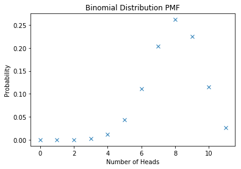
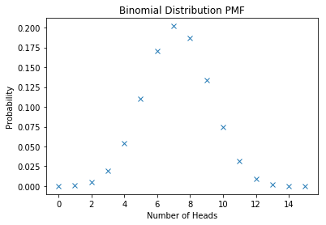

# Binomial Distributions

## SWBAT:

1. Understand and describe a binomial distribution as a Probability Mass function 
2. Evaluate a problem to discuss its fitness for a binomial experiment
3. Calculate probability of an event from a binomial distribution
4. Evaluate calculations with scipy functions

What is a Binomial Distribution?

A binomial distribution is simply the probability of a SUCCESS or FAILURE outcome in an experiment or survey that is repeated multiple times. The binomial is a type of distribution that has two possible outcomes (the prefix “bi” means two, or twice). For example, a coin toss has only two possible outcomes: heads or tails and taking a test could have two possible outcomes: pass or fail.

The first variable in the binomial formula, n, stands for the number of times the experiment runs. The second variable, $p$, represents the probability of one specific outcome.
The binomial distribution formula is:

> **$$Pr(X=k)=C(n,k)p^k (1-p)^{n-k}$$**

Where:
* $n$ = number of trials
* $k$ = number of successes
* $p$ = probability of success
* $1-p$ = probability of failure (often written as $q=1-p$).


Let's see an example question first, and then learn about the binomial distribution.

Example 1: Two players are playing baseball as **Player A** and **Player B**. 
* Player A takes an average of 11 shots per game, and has an average success rate of 72% 
* Player B takes an average of 15 shots per game, but has an average success rate of 48%

Question 1: What's the probability that Player A makes 6 shots in an average game?

Question 2: What's the probability that Player B makes 6 shots in an average game?


Check for Binomial Distribution

We can identify a problem as a binomial experiment if the following conditions are successfully met:

1. The process consists of a sequence of trials, where $n$ is the number of trials
2. Only two mutually exclusive results are expected for each trial (A success and a failure)
3. If the probability of a success is $p$ then the probability of failure is $q=1-p$ (because of two mutually exclusive states)
4. All of the trials are done independently

We can see that the example given above meets all these considtions and hence satisfies the binomial assumption. 


* This means that to get exactly $k$ successes in $n$ trials, we want exactly $k$ successes: 

$$p^k$$

* We also want $(n-k)$ failures:

$$(1-p)^{n-k}$$

* There are $$C(n,k)$$ ways of putting $k$ successes in $n$ trials.

Note: $C(n,k)$ refers to the number of possible combinations of $n$ things taken $k$ at a time.

You have seen this in the combinatorics section! This is equal to: $$C(n,k) =  \frac{n!}{k!(n-k)!}$$

Let's go back to example problem and see how this works. 


```python
# The number of combinations of n things taken k at a time
# This is often expressed as “n choose k”
import numpy as np
from scipy.special import comb
import matplotlib.pyplot as plt
```


```python
def calc_prob(player, p, n, k):

    # Calculate the number of possible combinations of n shots and k expected shots 
    combs = comb(n,k)

    # Now put it together to get the probability using given formula
    prob = combs * (p**k) * ((1-p)**(n-k))

    # Put the answer in percentage form!
    prob= 100*prob
    
    # Print the result with calculated probability value
    print (' The probability of player' , player, 'making' ,k, 'shots in an average game is %1.1f%% ' %prob)
    print (' \n')
    
    return None

p_A = 0.72
p_B = 0.48
n_A = 11
n_B = 15
k = 6

# Calculate the probability for player A and B taking 6 shots per game
calc_prob('A', p_A, n_A, k)
calc_prob('B', p_B, n_B, k)

```

     The probability of player A making 6 shots in an average game is 11.1% 
     
    
     The probability of player B making 6 shots in an average game is 17.0% 
     
    


So now we know that even though player B is a poor shooter (p_B < p_A), because he takes more shots than player A (n_B > n_A), he will have better chances of making 6 successful shots in a game. 

We must also consider the higher amount of shots by player B. 

Will player's A higher probability take a stronger effect if we consider the number of shots?
What's the probability of making 9 successful shots a game for either player?

Let's use above function with a different value of k = 9 to find this out 


```python
# set number of shots = 9 
k = 9
prob_A = calc_prob('A', p_A, n_A, k)
prob_B = calc_prob('B', p_B, n_B, k)
```

     The probability of player A making 9 shots in an average game is 22.4% 
     
    
     The probability of player B making 9 shots in an average game is 13.4% 
     
    


This shows us that player's A ability level gives better odds of making **exactly** 9 shots. We need to keep in mind that we are asking about the probability of making exactly those amount of shots. 

This is a different question than "What is the probability that player A makes at least 9 shots?"

### Mean and standard deviation for binomial distribution

The mean of a binomial distribution is the average number of successes, and this is equal to total trials multiplied by average success rate.


$$\mu=n*p$$


The standard deviation of a binomial is:
$$\sigma=\sqrt{n*q*p}$$

#### Question:

> What is the average number of shots each player will make in a game, along with standard deviation?


```python
def mean_sd(player, n, p):
    mu = n*p
    sigma =np.sqrt((n*p*(1-p)))
    print ('Player', player, 'will make an average of', np.round(mu),'+/- ',np.round(sigma), 'shots per game')
    print ('\n')

    return None
mean_sd('A', n_A, p_A)
mean_sd('B', n_B, p_B)
```

    Player A will make an average of 8.0 +/-  1.0 shots per game
    
    
    Player B will make an average of 7.0 +/-  2.0 shots per game
    
    


So we can see that player B expected shots have a larger value of sigma , adding to the uncertainty around player B. 

Let's confirm our results using scipy's built in binomial distribution function and see if the results compare with our calculations. 


```python
from scipy.stats import binom

mean,sd= binom.stats(n_A,p_A)
print (np.round(mean), np.round(sd**0.5))

mean,sd= binom.stats(n_B,p_B)
print (np.round(mean), np.round(sd**0.5))
```

    8.0 1.0
    7.0 2.0


**NOTE** above values have been rounded to nearest whole number as we can not take a "decimal" of a shot. 

The results from `scipy.binom` confirm our calculations above. 

Now, let's draw probability mass functions for both player A and player B.


```python
#Probability Mass Function

def draw_pmf(player,n,p):
    # Set up n success, remember indexing starts at 0, so use n+1
    x = range(n+1)
    
    # Now create the probability mass function
    Y = binom.pmf(x,n,p)
    
    plt.plot(x,Y,'x')
    plt.title('Binomial Distribution PMF')
    #Axis Titles
    plt.xlabel('Number of Heads')
    plt.ylabel('Probability')
    return None

draw_pmf('A', n_A, p_A)
```





```python
draw_pmf('B', n_B, p_B)
```





### Summary 

In this lesson, we saw how a binomial distribution works and what factors must be ensured in order to satisfy a binomial experiment. We used a simple example along with relevant binomial calculations in python. The results were verified using scipy's built in function. The results were also visualized in order to explain the phenomenon better
